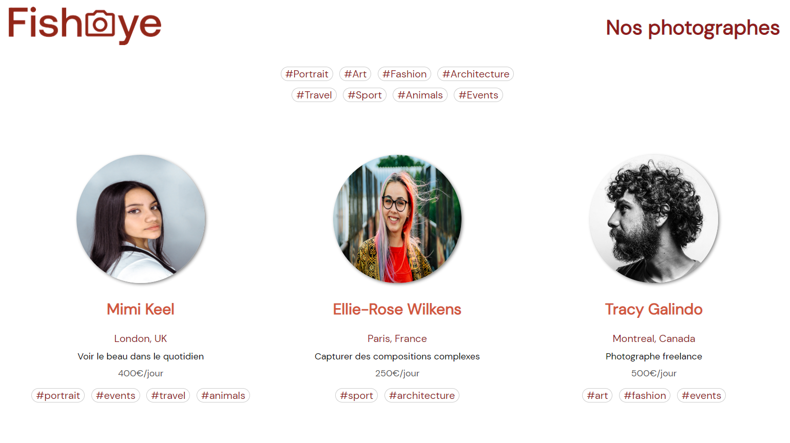

# Fisheye - Plateforme de photographes

HTML / CSS / JAVASCRIPT

@Openclassrooms

## Objectifs

* Assurer l'accessibilité d'un site web
* Gérer les évènements d'un site avec JavaScript
* Développer une application web modulaire avec des design patterns
* Ecrire du code JavaScript maintenable
